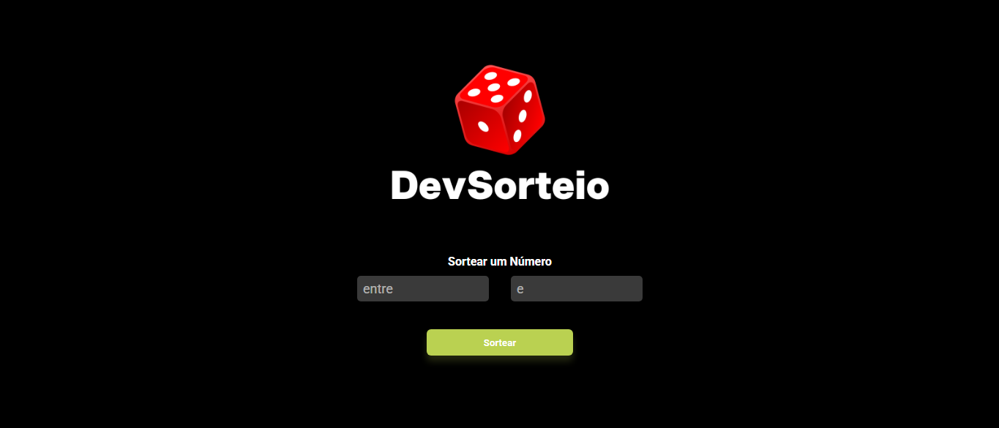

<h1>Raffle Project</h1>

 

This project was based on a pre-existing design.  
<strong>Credits: 
<a href="https://rodolfomori.com.br">DevClub</a>

</strong>

<h3>Technologies used:</h3>

<strong>silvadevv</strong>

